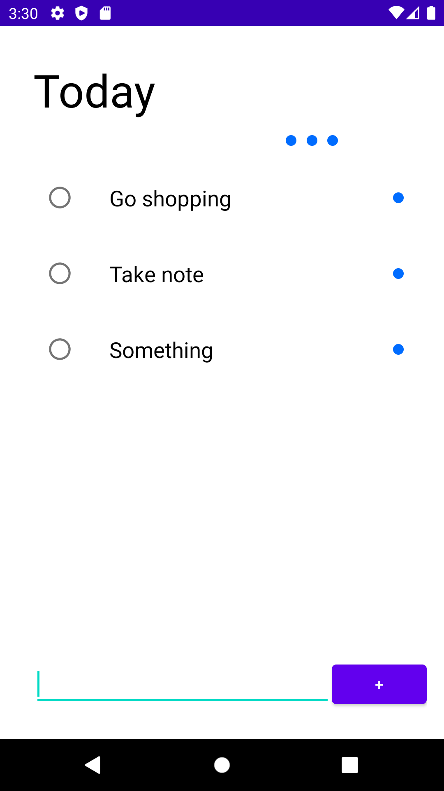
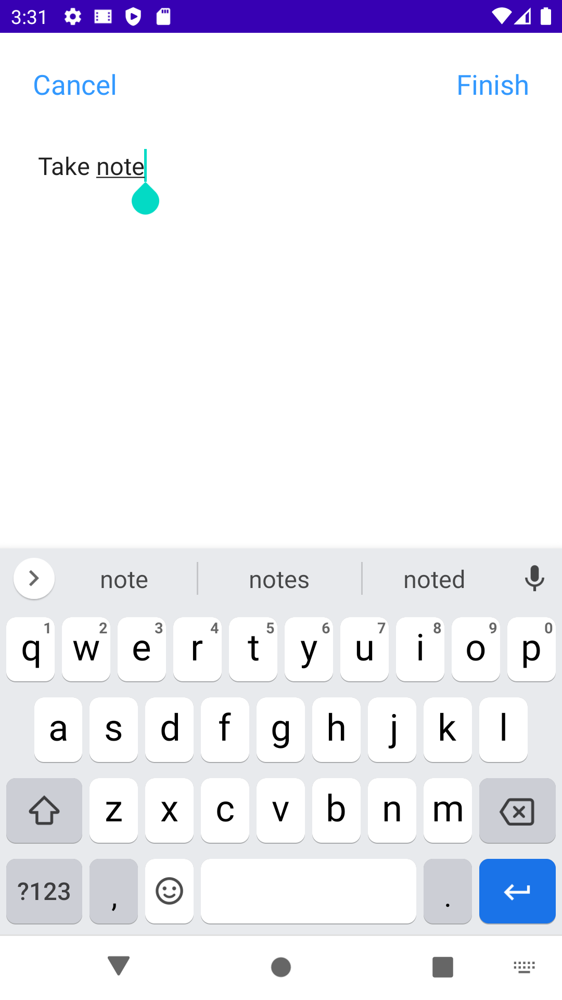

"# todoList---Native" 

## Simple Todolist

This is a todo list i created with Room Database.

## Preview
 

## Installation
Clone this repository and import into **Android Studio**
```bash
git clone git@github.com:wolox/<reponame>.git
```

## Built with
* Kotlin
* Room
* Coroutines

